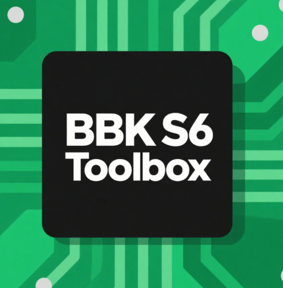

# BBK S6 Toolbox
<div align="center">
  
  <h1>BBK S6 Toolbox</h1>
  <p>步步高S6玩机工具箱</p>
  <a href="https://www.gnu.org/licenses/gpl-3.0">
    
  </a>
</div>

By huang1057 - GH工作室

EEBBK S6 玩机工具箱 - 永久免费，严禁倒卖！
---

## 关于步步高家教机解除第三方软件安装限制免责声明
*协议更新日期：2022年2月6日*
1. 所有已经解除第三方软件安装限制的家教机都可以恢复到解除限制前之状态。
2. 解除第三方软件安装限制后，家教机可以无限制地安装第三方软件，需要家长加强对孩子的监管力度，避免孩子沉迷网络，影响学习；家教机自带的学习功能不受影响。
3. 您对家教机进行解除第三方软件安装限制之操作属于您的自愿行为，若在操作过程中由于操作不当等自身原因，导致出现家教机无法正常使用等异常情况，以及解除软件安装限制之后产生的一切后果将由您本人承担！
4. 如果您使用本工具包对家教机进行解除第三方软件安装限制之操作，即默认您同意本《免责声明》。

---

### 许可证声明  
**本项目严格遵循 [GNU通用公共许可证3.0（GPL V3.0）](https://www.gnu.org/licenses/gpl-3.0.en.html) 发布。**  

#### 您必须遵守的核心义务：  
1. **源代码提供**：  
   分发二进制产物时，必须同时提供完整的、可修改的源代码（通过下载链接或物理介质）。  
2. **协议传染性**：  
   基于本项目衍生的作品必须使用**相同的GPL V3.0协议**发布。  
3. **版权声明保留**：  
   不得删除原始版权声明和本许可证文档（[LICENSE](LICENSE)）。  

⚠️ **法律风险警示**：  
> 任何违反GPL V3.0的行为（如未提供源代码即售卖二进制文件）将导致：  
> - 自动丧失本许可证授予的权利；  
> - 可能面临著作权侵权诉讼；  
> - 迫使项目停止维护。  

---
#### 版权声明
~~~
Copyright (C) 2025  huang1057 & Starry Sky Team

This program is free software: you can redistribute it and/or modify
it under the terms of the GNU General Public License as published by
the Free Software Foundation, either version 3 of the License, or
(at your option) any later version.

This program is distributed in the hope that it will be useful,
but WITHOUT ANY WARRANTY; without even the implied warranty of
MERCHANTABILITY or FITNESS FOR A PARTICULAR PURPOSE.  See the
GNU General Public License for more details.

You should have received a copy of the GNU General Public License
along with this program.  If not, see <https://www.gnu.org/licenses/>.
~~~
---
### 协议文本  
- [GPL V3.0 英文原文](https://www.gnu.org/licenses/gpl-3.0.en.html)  
- [GPL V3.0 非官方中文译本](https://www.gnu.org/licenses/gpl-3.0.zh-cn.html)（仅供参考，法律效力以英文版为准）
### 使用框架说明
```diff
+ 基于酷安@某贼的 [BFF框架](https://gitee.com/mouzei/bff) 构建
